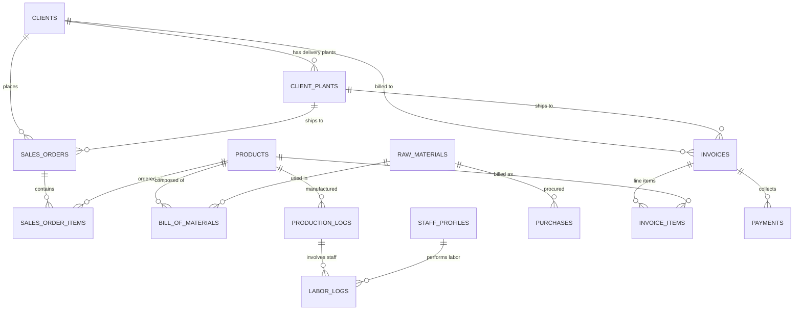

# Praful Welding Works ERP - Database Schema & ERD

This document provides a comprehensive technical overview of the database structure, table fields, data types, relationships, local scopes, and foreign key constraints powering **Praful Welding Works ERP**.

---

## 🗄️ Entity-Relationship (ER) Diagram Overview

---

## 📋 Database Tables & Eloquent Scopes Reference

### 1. `users` (Model: `App\Models\User`)
Stores authenticated ERP portal users, administrators, and role permissions.

| Column | Type | Constraints | Description |
| :--- | :--- | :--- | :--- |
| `id` | BigInt | Primary Key, Auto Increment | Unique User ID |
| `name` | Varchar(255) | Not Null | User Full Name |
| `email` | Varchar(255) | Unique, Not Null | Login Email Address |
| `password` | Varchar(255) | Not Null | Bcrypted Password Hash |
| `role` | Varchar(50) | Default: 'super_admin' | Access Role (`super_admin`, `admin`, `staff`, `accountant`, `auditor`) |
| `status` | Varchar(50) | Default: 'active' | Account Status (`active`, `pending`, `suspended`) |
| `is_active` | Boolean | Default: true | Active Flag |
| `permissions` | JSON | Nullable | Custom Permission Matrix Array |
| `created_at` | Timestamp | Nullable | Creation Timestamp |
| `updated_at` | Timestamp | Nullable | Update Timestamp |

- **Local Scopes**: `scopeActive($query)`

---

### 2. `raw_materials` (Model: `App\Models\RawMaterial`)
Stores raw material stock levels, measurement units, purchase price averages, and safety threshold alert limits.

| Column | Type | Constraints | Description |
| :--- | :--- | :--- | :--- |
| `id` | BigInt | Primary Key, Auto Increment | Unique Raw Material ID |
| `material_name` | Varchar(255) | Unique, Not Null | Material Title (e.g. MS Angle 50x50x5mm) |
| `hsn_code` | Varchar(50) | Nullable | HSN Harmonized System Code |
| `unit` | Varchar(50) | Not Null | Unit of Measure (`KG`, `NOS`, `MTR`, `LTR`) |
| `unit_price` | Decimal(10,2) | Default: 0.00 | Average Purchase Cost Per Unit (₹) |
| `reorder_level` | Decimal(12,4) | Default: 0.0000 | Minimum Safety Threshold Alert Limit |
| `current_stock` | Decimal(12,4) | Default: 0.0000 | Live Available Stock Quantity |
| `created_at` | Timestamp | Nullable | Creation Timestamp |
| `updated_at` | Timestamp | Nullable | Update Timestamp |

---

### 3. `products` (Model: `App\Models\Product`)
Catalog of manufactured finished goods (welded racks, pallets, structures).

| Column | Type | Constraints | Description |
| :--- | :--- | :--- | :--- |
| `id` | BigInt | Primary Key, Auto Increment | Unique Product ID |
| `product_name` | Varchar(255) | Not Null | Product Model Name |
| `hsn_code` | Varchar(50) | Nullable | HSN Harmonized System Code |
| `unit` | Varchar(50) | Default: 'NOS' | Unit of Measure (`NOS`, `SET`, `KG`) |
| `unit_price` | Decimal(10,2) | Not Null | Unit Price Per Piece (₹) |
| `gst_rate` | Decimal(5,2) | Default: 18.00 | Tax Percentage (`18.00`, `12.00`, `5.00`) |
| `unit_weight_kg` | Decimal(10,3) | Default: 0.000 | Net Weight Per Unit (Kg) |
| `price_per_kg` | Decimal(10,2) | Nullable | Unit Price Per Kg (₹) |
| `reorder_level` | Integer | Default: 0 | Safety Reorder Threshold |
| `current_stock` | Integer | Default: 0 | Finished Goods Available Stock |
| `safety_threshold` | Integer | Default: 10 | Minimum Stock Safety Alert Level |
| `created_at` | Timestamp | Nullable | Creation Timestamp |
| `updated_at` | Timestamp | Nullable | Update Timestamp |

---

### 4. `bill_of_materials` (Model: `App\Models\BillOfMaterial`)
Composition formula mapping finished products to exact quantities of raw materials.

| Column | Type | Constraints | Description |
| :--- | :--- | :--- | :--- |
| `id` | BigInt | Primary Key, Auto Increment | Unique BOM Entry ID |
| `product_id` | BigInt | FK -> `products.id` (Cascade) | Target Product |
| `raw_material_id` | BigInt | FK -> `raw_materials.id` (Cascade) | Component Raw Material |
| `required_quantity` | Decimal(12,4) | Not Null | Quantity Needed Per 1 Unit Output |
| `waste_percentage` | Decimal(5,2) | Default: 0.00 | Scrap/Waste Allowance Percentage |
| `created_at` | Timestamp | Nullable | Creation Timestamp |
| `updated_at` | Timestamp | Nullable | Update Timestamp |

---

### 5. `production_logs` (Model: `App\Models\ProductionLog`)
Logs daily rack manufacturing output and triggers raw material stock deduction.

| Column | Type | Constraints | Description |
| :--- | :--- | :--- | :--- |
| `id` | BigInt | Primary Key, Auto Increment | Unique Log ID |
| `product_id` | BigInt | FK -> `products.id` | Manufactured Product Model |
| `quantity_manufactured` | Integer | Not Null | Completed Output Quantity |
| `quantity_rejected` | Integer | Default: 0 | Rejected Output Quantity |
| `recorded_by` | BigInt | FK -> `users.id` | Recording Staff User ID |
| `production_date` | Date | Not Null | Production Date |
| `created_at` | Timestamp | Nullable | Creation Timestamp |
| `updated_at` | Timestamp | Nullable | Update Timestamp |

---

### 6. `staff_profiles` & `labor_logs`

#### `staff_profiles` (Model: `App\Models\StaffProfile`)
| Column | Type | Constraints | Description |
| :--- | :--- | :--- | :--- |
| `id` | BigInt | Primary Key | Staff ID |
| `worker_id` | Varchar(50) | Unique | Employee Badge/ID Code |
| `name` | Varchar(255) | Not Null | Staff Full Name |
| `phone` | Varchar(50) | Nullable | Contact Phone Number |
| `designation` | Varchar(100) | Default: 'Welder' | Staff Designation |
| `wage_type` | Varchar(50) | Default: 'per-day' | Compensation Model (`per-day`, `piece-rate`) |
| `daily_rate` | Decimal(10,2) | Default: 0.00 | Fixed Daily Salary (₹) |
| `piece_rate_per_unit` | Decimal(10,2) | Default: 0.00 | Per-Piece Rate Payout (₹) |
| `overtime_rate_per_hour` | Decimal(10,2) | Default: 0.00 | Overtime Rate (₹/hr) |
| `joining_date` | Date | Nullable | Date of Joining |
| `status` | Varchar(50) | Default: 'active' | Employment Status (`active`, `inactive`) |

#### `labor_logs` (Model: `App\Models\LaborLog`)
| Column | Type | Constraints | Description |
| :--- | :--- | :--- | :--- |
| `id` | BigInt | Primary Key | Log ID |
| `staff_profile_id` | BigInt | FK -> `staff_profiles.id` | Employee Assigned |
| `production_log_id` | BigInt | FK -> `production_logs.id` | Associated Production Log |
| `units_completed` | Integer | Not Null | Units Welded / Assembled |
| `calculated_payout` | Decimal(10,2) | Not Null | Total Calculated Wage Payout (₹) |
| `status` | Varchar(50) | Default: 'pending' | Payout Status (`pending`, `paid`) |

---

### 7. `clients` & `client_plants`

#### `clients` (Model: `App\Models\Client`)
| Column | Type | Constraints | Description |
| :--- | :--- | :--- | :--- |
| `id` | BigInt | Primary Key | Client ID |
| `company_name` | Varchar(255) | Not Null | Company Name |
| `client_name` | Varchar(255) | Nullable | Primary Contact Person |
| `email` | Varchar(255) | Nullable | Contact Email |
| `phone` | Varchar(50) | Nullable | Contact Phone |
| `gstin` | Varchar(20) | Nullable | 15-Digit GSTIN |
| `pan` | Varchar(20) | Nullable | PAN Number |
| `billing_address` | Text | Nullable | Office Address |
| `city` | Varchar(100) | Nullable | City |
| `state` | Varchar(100) | Nullable | State Name |
| `pincode` | Varchar(20) | Nullable | Pincode |

#### `client_plants` (Model: `App\Models\ClientPlant`)
| Column | Type | Constraints | Description |
| :--- | :--- | :--- | :--- |
| `id` | BigInt | Primary Key | Plant ID |
| `client_id` | BigInt | FK -> `clients.id` (Cascade) | Parent Client |
| `plant_name` | Varchar(255) | Not Null | Shipping Plant Name |
| `gstin` | Varchar(20) | Nullable | Delivery Site GSTIN |
| `state` | Varchar(100) | Nullable | Plant State Name |
| `plant_address` | Text | Nullable | Factory Shipping Address |
| `phone` | Varchar(50) | Nullable | Plant Contact Phone |
| `email` | Varchar(255) | Nullable | Plant Email |

---

### 8. `sales_orders` (Model: `App\Models\SalesOrder`)
Sales contracts and order items.

| Column | Type | Constraints | Description |
| :--- | :--- | :--- | :--- |
| `id` | BigInt | Primary Key | Order ID |
| `order_number` | Varchar(100) | Unique | Order Document Number (e.g. PWW-ORD-0001) |
| `po_number` | Varchar(100) | Nullable | Client PO Number |
| `client_id` | BigInt | FK -> `clients.id` | Ordering Client |
| `plant_id` | BigInt | FK -> `client_plants.id` | Delivery Plant |
| `order_date` | Date | Not Null | Order Creation Date |
| `delivery_date` | Date | Nullable | Target Delivery Date |
| `status` | Varchar(50) | Default: 'pending' | Status (`pending`, `in_production`, `ready_for_dispatch`, `dispatched`, `completed`, `cancelled`) |
| `total_amount` | Decimal(12,2) | Not Null | Total Order Value (₹) |

- **Local Scopes**: `scopePending()`, `scopeInProduction()`, `scopeReady()`, `scopeCompleted()`

---

### 9. `invoices` (Model: `App\Models\Invoice`)
Tax invoices, line items, and payment collections.

| Column | Type | Constraints | Description |
| :--- | :--- | :--- | :--- |
| `id` | BigInt | Primary Key | Invoice ID |
| `sales_order_id` | BigInt | FK -> `sales_orders.id` (NullOnDelete) | Linked Sales Order |
| `invoice_number` | Varchar(100) | Unique | Tax Invoice Number (e.g. PWW-0001) |
| `invoice_mode` | Varchar(50) | Default: 'finished_goods' | Mode (`finished_goods`, `raw_material`) |
| `plant_id` | BigInt | FK -> `client_plants.id` | Delivery Plant |
| `vehicle_number` | Varchar(50) | Nullable | Transport Vehicle Registration Number |
| `invoice_date` | Date | Not Null | Invoice Billing Date |
| `total_taxable_value` | Decimal(12,2) | Not Null | Taxable Subtotal (₹) |
| `cgst` | Decimal(10,2) | Default: 0.00 | Central GST Amount (₹) |
| `sgst` | Decimal(10,2) | Default: 0.00 | State GST Amount (₹) |
| `igst` | Decimal(10,2) | Default: 0.00 | Integrated GST Amount (₹) |
| `total_amount` | Decimal(12,2) | Not Null | Grand Total Invoice Amount (₹) |
| `paid_amount` | Decimal(12,2) | Default: 0.00 | Collected Payment Amount (₹) |
| `payment_status` | Varchar(50) | Default: 'unpaid' | Status (`unpaid`, `partial`, `paid`) |

- **Local Scopes**: `scopePaid()`, `scopeUnpaid()`, `scopePartial()`

---

### 10. `activity_logs` (Model: `App\Models\ActivityLog`)
Super-admin security audit trail and system action logs.

| Column | Type | Constraints | Description |
| :--- | :--- | :--- | :--- |
| `id` | BigInt | Primary Key, Auto Increment | Unique Log Entry ID |
| `user_id` | BigInt | FK -> `users.id` (NullOnDelete) | User ID who performed action |
| `user_name` | Varchar(255) | Default: 'System' | User Name cached for audit durability |
| `user_role` | Varchar(50) | Default: 'system' | User Role (`super_admin`, `admin`, `staff`, etc.) |
| `module` | Varchar(100) | Indexed | Target Module (`Invoices`, `Purchases`, `Inventory`, `Expenses`, `Payroll`, `Settings`, `Auth`) |
| `action` | Varchar(50) | Indexed | Action Type (`created`, `updated`, `deleted`, `login`, `logout`, `security`) |
| `description` | Text | Not Null | Detailed human-readable action log |
| `changes` | JSON | Nullable | Optional before/after payload array |
| `ip_address` | Varchar(45) | Nullable | Client IP Address |
| `user_agent` | Text | Nullable | Client Browser / Device User Agent |
| `created_at` | Timestamp | Nullable | Creation Timestamp |
| `updated_at` | Timestamp | Nullable | Update Timestamp |

---

### 11. `salary_advances` (Model: `App\Models\SalaryAdvance`)
Tracks worker salary advance payouts and automatic payroll deductions.

| Column | Type | Constraints | Description |
| :--- | :--- | :--- | :--- |
| `id` | BigInt | Primary Key, Auto Increment | Unique Advance ID |
| `staff_profile_id` | BigInt | FK -> `staff_profiles.id` (Cascade) | Target Employee |
| `advance_date` | Date | Not Null | Date of Advance Payout |
| `amount` | Decimal(12,2) | Default: 0.00 | Advance Amount Paid (₹) |
| `payment_method` | Varchar(255) | Default: 'Cash' | Method (`Cash`, `Bank Transfer`, `UPI`, `Cheque`) |
| `status` | Enum | Default: 'pending' | Status (`pending`, `deducted`) |
| `expense_id` | BigInt | Nullable | Linked Auto-Generated Expense Record ID |
| `salary_disbursal_id` | BigInt | Nullable | Linked Salary Disbursal ID where advance was deducted |
| `notes` | Text | Nullable | Optional Notes |
| `created_at` | Timestamp | Nullable | Creation Timestamp |
| `updated_at` | Timestamp | Nullable | Update Timestamp |

---

### 12. `stock_adjustments` (Model: `App\Models\StockAdjustment`)
Inventory physical audit adjustments and variance stock logs.

| Column | Type | Constraints | Description |
| :--- | :--- | :--- | :--- |
| `id` | BigInt | Primary Key, Auto Increment | Unique Adjustment Log ID |
| `raw_material_id` | BigInt | FK -> `raw_materials.id` (Cascade) | Target Raw Material |
| `user_id` | BigInt | FK -> `users.id` (NullOnDelete) | Admin/Staff User ID performing adjustment |
| `user_name` | Varchar(255) | Default: 'Admin' | User Name cached for audit durability |
| `previous_stock` | Decimal(15,4) | Default: 0.0000 | Stock before adjustment |
| `new_stock` | Decimal(15,4) | Default: 0.0000 | New verified physical stock quantity |
| `variance_qty` | Decimal(15,4) | Default: 0.0000 | Stock Variance (+ or -) |
| `reason` | Varchar(255) | Not Null | Adjustment Reason (Physical Audit, Waste, Damaged, Correction) |
| `notes` | Text | Nullable | Additional Auditor Remarks |
| `adjusted_at` | Timestamp | Default: Current | Audit Timestamp |
| `created_at` | Timestamp | Nullable | Creation Timestamp |
| `updated_at` | Timestamp | Nullable | Update Timestamp |

---

### 13. `salary_disbursals` (Model: `App\Models\SalaryDisbursal`)
Monthly payroll ledger and staff salary disbursals.

| Column | Type | Constraints | Description |
| :--- | :--- | :--- | :--- |
| `id` | BigInt | Primary Key, Auto Increment | Unique Disbursal ID |
| `staff_profile_id` | BigInt | FK -> `staff_profiles.id` (Cascade) | Target Employee |
| `month_year` | Varchar(7) | Not Null | Year and Month of Disbursal (e.g. "2026-07") |
| `wage_type` | Enum | Default: 'per-day' | Compensation Model (`fixed`, `per-day`) |
| `rate_amount` | Decimal(12,2) | Default: 0.00 | Pay Rate Per Day / Per Month (₹) |
| `days_present` | Decimal(5,1) | Default: 0.0 | Count of Days Present |
| `total_salary` | Decimal(12,2) | Default: 0.00 | Gross Calculated Salary (₹) |
| `advance_deduction` | Decimal(12,2) | Default: 0.00 | Advance Salary Amount Deducted (₹) |
| `status` | Enum | Default: 'pending' | Status (`pending`, `paid`) |
| `payment_date` | Date | Nullable | Date of Payment |
| `payment_method` | Varchar(255) | Default: 'Cash' | Method (`Cash`, `Bank Transfer`, `UPI`) |
| `expense_id` | BigInt | Nullable | Linked Expense Record ID |
| `notes` | Text | Nullable | Optional Remarks |
| `created_at` | Timestamp | Nullable | Creation Timestamp |
| `updated_at` | Timestamp | Nullable | Update Timestamp |

---

### 14. `attendance_records` (Model: `App\Models\AttendanceRecord`)
Daily attendance tracking log for worker payroll computation.

| Column | Type | Constraints | Description |
| :--- | :--- | :--- | :--- |
| `id` | BigInt | Primary Key, Auto Increment | Unique Attendance ID |
| `staff_profile_id` | BigInt | FK -> `staff_profiles.id` (Cascade) | Target Employee |
| `date` | Date | Not Null | Date of Attendance |
| `status` | Enum | Default: 'present' | Daily Status (`present`, `half_day`, `absent`) |
| `notes` | Text | Nullable | Optional Attendance Remarks |
| `created_at` | Timestamp | Nullable | Creation Timestamp |
| `updated_at` | Timestamp | Nullable | Update Timestamp |

