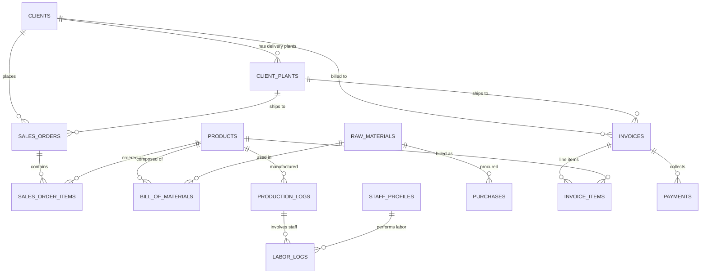

# Praful Welding Works ERP - Database Schema & ERD

This document provides a comprehensive technical overview of the database structure, table fields, data types, relationships, and foreign key constraints powering the **Praful Welding Works ERP** system.

---

## 🗄️ Entity-Relationship (ER) Diagram Overview

---

## 📋 Database Tables Reference

### 1. `users`
Stores authenticated ERP portal system users and administrators.

| Column | Type | Constraints | Description |
| :--- | :--- | :--- | :--- |
| `id` | BigInt | Primary Key, Auto Increment | Unique User ID |
| `name` | Varchar(255) | Not Null | User Full Name |
| `email` | Varchar(255) | Unique, Not Null | Login Email Address |
| `password` | Varchar(255) | Not Null | Bcrypted Password Hash |
| `role` | Varchar(50) | Default: 'admin' | Access Role (`admin`, `staff`) |
| `remember_token` | Varchar(100) | Nullable | Remember Me Token |
| `created_at` | Timestamp | Nullable | Creation Timestamp |
| `updated_at` | Timestamp | Nullable | Update Timestamp |

---

### 2. `raw_materials`
Stores raw material stock levels, measurement units, purchase price averages, and safety threshold alert limits.

| Column | Type | Constraints | Description |
| :--- | :--- | :--- | :--- |
| `id` | BigInt | Primary Key, Auto Increment | Unique Raw Material ID |
| `material_name` | Varchar(255) | Unique, Not Null | Material Title (e.g. Iron Wire Coils 5mm) |
| `unit` | Varchar(50) | Not Null | Unit of Measure (`kg`, `liter`, `meter`, `packet`) |
| `current_stock` | Decimal(12,4) | Default: 0.0000 | Live Available Quantity |
| `safety_threshold` | Decimal(12,4) | Not Null | Minimum Stock Alert Limit |
| `average_purchase_price` | Decimal(10,2) | Not Null | Average Purchase Cost Per Unit (₹) |
| `created_at` | Timestamp | Nullable | Creation Timestamp |
| `updated_at` | Timestamp | Nullable | Update Timestamp |

---

### 3. `products`
Catalog of manufactured finished goods (welded racks, structures).

| Column | Type | Constraints | Description |
| :--- | :--- | :--- | :--- |
| `id` | BigInt | Primary Key, Auto Increment | Unique Product ID |
| `product_name` | Varchar(255) | Not Null | Product Model Name |
| `sku` | Varchar(100) | Unique, Not Null | SKU Code (e.g. WR-3T-BALAJI) |
| `hsn_code` | Varchar(50) | Nullable | HSN Harmonized System Code |
| `uom` | Varchar(50) | Default: 'piece' | Unit of Measure (`piece`, `kg`, `set`) |
| `unit_weight_kg` | Decimal(10,3) | Default: 0.000 | Net Weight Per Unit (Kg) |
| `current_stock` | Integer | Default: 0 | Finished Goods Stock Level |
| `selling_price` | Decimal(10,2) | Not Null | Unit Price Per Piece (₹) |
| `price_per_kg` | Decimal(10,2) | Nullable | Unit Price Per Kg (₹) |
| `gst_rate` | Decimal(5,2) | Default: 18.00 | Tax Percentage (`18.00`, `12.00`, `5.00`) |
| `created_at` | Timestamp | Nullable | Creation Timestamp |
| `updated_at` | Timestamp | Nullable | Update Timestamp |

---

### 4. `bill_of_materials` (BOM)
Composition formula mapping finished products to exact quantities of raw materials.

| Column | Type | Constraints | Description |
| :--- | :--- | :--- | :--- |
| `id` | BigInt | Primary Key, Auto Increment | Unique BOM Entry ID |
| `product_id` | BigInt | FK -> `products.id` (Cascade) | Target Product |
| `raw_material_id` | BigInt | FK -> `raw_materials.id` (Cascade) | Component Raw Material |
| `quantity_required` | Decimal(12,4) | Not Null | Quantity Needed Per 1 Unit Output |
| `unit` | Varchar(50) | Not Null | Raw Material Unit |
| `created_at` | Timestamp | Nullable | Creation Timestamp |
| `updated_at` | Timestamp | Nullable | Update Timestamp |

---

### 5. `production_logs`
Logs daily rack manufacturing output and triggers raw material stock deduction.

| Column | Type | Constraints | Description |
| :--- | :--- | :--- | :--- |
| `id` | BigInt | Primary Key, Auto Increment | Unique Log ID |
| `production_date` | Date | Not Null | Production Date |
| `product_id` | BigInt | FK -> `products.id` | Manufactured Product Model |
| `quantity_produced` | Integer | Not Null | Output Completed Quantity |
| `notes` | Text | Nullable | Workshift Notes |
| `created_at` | Timestamp | Nullable | Creation Timestamp |
| `updated_at` | Timestamp | Nullable | Update Timestamp |

---

### 6. `staff_profiles` & `labor_logs`
Stores employee profiles and daily piece-rate labor payout records.

#### `staff_profiles`
| Column | Type | Constraints | Description |
| :--- | :--- | :--- | :--- |
| `id` | BigInt | Primary Key | Staff ID |
| `name` | Varchar(255) | Not Null | Staff Full Name |
| `phone` | Varchar(50) | Nullable | Contact Phone Number |
| `designation` | Varchar(100) | Default: 'Welder' | Staff Role (`Welder`, `Helper`, `Fitter`) |
| `wage_type` | Varchar(50) | Default: 'piece_rate' | Compensation Model (`piece_rate`, `daily`) |
| `daily_rate` | Decimal(10,2) | Default: 0.00 | Fixed Daily Salary (₹) |
| `piece_rate` | Decimal(10,2) | Default: 0.00 | Per-Piece Rate Payout (₹) |
| `is_active` | Boolean | Default: true | Employment Status |

#### `labor_logs`
| Column | Type | Constraints | Description |
| :--- | :--- | :--- | :--- |
| `id` | BigInt | Primary Key | Log ID |
| `production_log_id` | BigInt | FK -> `production_logs.id` | Associated Production Output Log |
| `staff_profile_id` | BigInt | FK -> `staff_profiles.id` | Employee Assigned |
| `pieces_completed` | Integer | Not Null | Units Welded / Assembled |
| `piece_rate` | Decimal(10,2) | Not Null | Locked Payout Rate Per Piece (₹) |
| `total_payout` | Decimal(10,2) | Not Null | Total Wage (`pieces * rate`) |

---

### 7. `clients` & `client_plants`
Stores client directories and shipping delivery addresses.

#### `clients`
| Column | Type | Constraints | Description |
| :--- | :--- | :--- | :--- |
| `id` | BigInt | Primary Key | Client ID |
| `client_name` | Varchar(255) | Not Null | Company / Client Name |
| `gstin` | Varchar(15) | Nullable | 15-Digit Indian GSTIN Number |
| `state_code` | Varchar(5) | Default: '24' | 2-Digit State Code (`24` for Gujarat) |
| `contact_person` | Varchar(255) | Nullable | Primary Contact |
| `phone` | Varchar(50) | Nullable | Phone Number |
| `email` | Varchar(255) | Nullable | Email Address |
| `billing_address` | Text | Nullable | Registered Office Address |

#### `client_plants`
| Column | Type | Constraints | Description |
| :--- | :--- | :--- | :--- |
| `id` | BigInt | Primary Key | Plant Delivery Location ID |
| `client_id` | BigInt | FK -> `clients.id` (Cascade) | Parent Client |
| `plant_name` | Varchar(255) | Not Null | Plant / Factory Site Title |
| `gstin` | Varchar(15) | Nullable | Delivery Site GSTIN |
| `state_code` | Varchar(5) | Default: '24' | Plant State Code |
| `delivery_address` | Text | Nullable | Factory Shipping Address |

---

### 8. `sales_orders` & `sales_order_items`
Sales contracts and order items.

| Column | Type | Constraints | Description |
| :--- | :--- | :--- | :--- |
| `order_number` | Varchar(100) | Unique | Order Identifier (e.g. SO-2026-001) |
| `client_id` | BigInt | FK -> `clients.id` | Ordering Client |
| `plant_id` | BigInt | FK -> `client_plants.id` | Destination Delivery Site |
| `order_date` | Date | Not Null | Order Creation Date |
| `status` | Varchar(50) | Default: 'pending' | Status (`pending`, `in_production`, `dispatched`, `completed`) |
| `total_amount` | Decimal(12,2) | Not Null | Total Order Value (₹) |

---

### 9. `invoices`, `invoice_items` & `payments`
Tax invoices, itemized line items, and payment transaction collections.

#### `invoices`
| Column | Type | Constraints | Description |
| :--- | :--- | :--- | :--- |
| `invoice_number` | Varchar(100) | Unique | Tax Invoice Number (e.g. PWW/26-27/0042) |
| `invoice_date` | Date | Not Null | Billing Date |
| `client_id` | BigInt | FK -> `clients.id` | Billed Client |
| `plant_id` | BigInt | FK -> `client_plants.id` | Shipping Site |
| `vehicle_number` | Varchar(50) | Nullable | Transport Vehicle Registration (e.g. GJ06AB1234) |
| `subtotal` | Decimal(12,2) | Not Null | Taxable Subtotal Amount (₹) |
| `cgst_amount` | Decimal(10,2) | Default: 0.00 | Central GST Amount (9%) |
| `sgst_amount` | Decimal(10,2) | Default: 0.00 | State GST Amount (9%) |
| `igst_amount` | Decimal(10,2) | Default: 0.00 | Integrated GST Amount (18%) |
| `total_amount` | Decimal(12,2) | Not Null | Grand Total Payable (₹) |
| `paid_amount` | Decimal(12,2) | Default: 0.00 | Collected Amount |
| `payment_status` | Varchar(50) | Default: 'unpaid' | Status (`unpaid`, `partially_paid`, `paid`) |

#### `payments`
| Column | Type | Constraints | Description |
| :--- | :--- | :--- | :--- |
| `invoice_id` | BigInt | FK -> `invoices.id` | Target Invoice |
| `payment_date` | Date | Not Null | Transaction Date |
| `amount` | Decimal(12,2) | Not Null | Received Payment Amount (₹) |
| `payment_mode` | Varchar(50) | Default: 'NEFT/RTGS' | Mode (`Cash`, `UPI`, `Cheque`, `NEFT/RTGS`) |
| `reference_number` | Varchar(100) | Nullable | UTR / Bank Reference |

---

### 10. `purchases` & `expenses`
Procurement logging and general operational expenses.

#### `purchases`
| Column | Type | Constraints | Description |
| :--- | :--- | :--- | :--- |
| `raw_material_id` | BigInt | FK -> `raw_materials.id` | Purchased Material |
| `vendor_name` | Varchar(255) | Not Null | Vendor / Supplier Title |
| `invoice_number` | Varchar(100) | Nullable | Vendor Tax Invoice No. |
| `quantity` | Decimal(12,4) | Not Null | Purchased Quantity |
| `purchase_price` | Decimal(10,2) | Not Null | Unit Purchase Rate (₹) |
| `total_amount` | Decimal(12,2) | Not Null | Total Procurement Cost (₹) |

#### `expenses`
| Column | Type | Constraints | Description |
| :--- | :--- | :--- | :--- |
| `expense_date` | Date | Not Null | Expense Date |
| `category` | Varchar(100) | Not Null | Category (`GST Liability Payment`, `Electricity`, `Transport`, `Rent`, `Maintenance`) |
| `description` | Text | Not Null | Description Details |
| `amount` | Decimal(12,2) | Not Null | Expense Amount (₹) |
| `is_gst_expense` | Boolean | Default: false | True if expense includes eligible Input Tax Credit (ITC) |
| `gst_paid_amount` | Decimal(10,2) | Default: 0.00 | Eligible Input Tax Credit Amount (₹) |
| `vendor_gstin` | Varchar(15) | Nullable | Vendor GSTIN |
