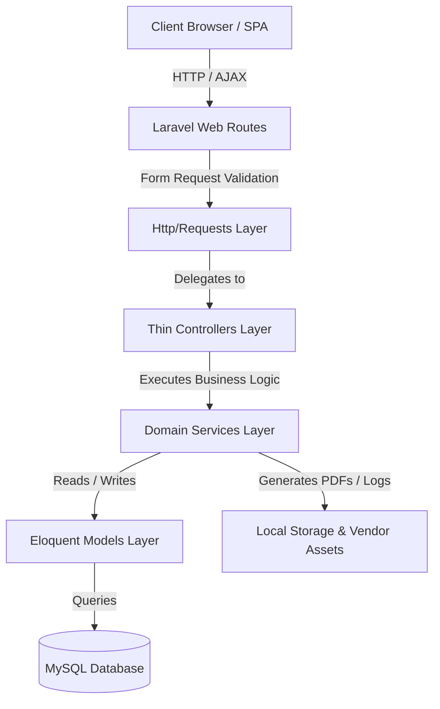
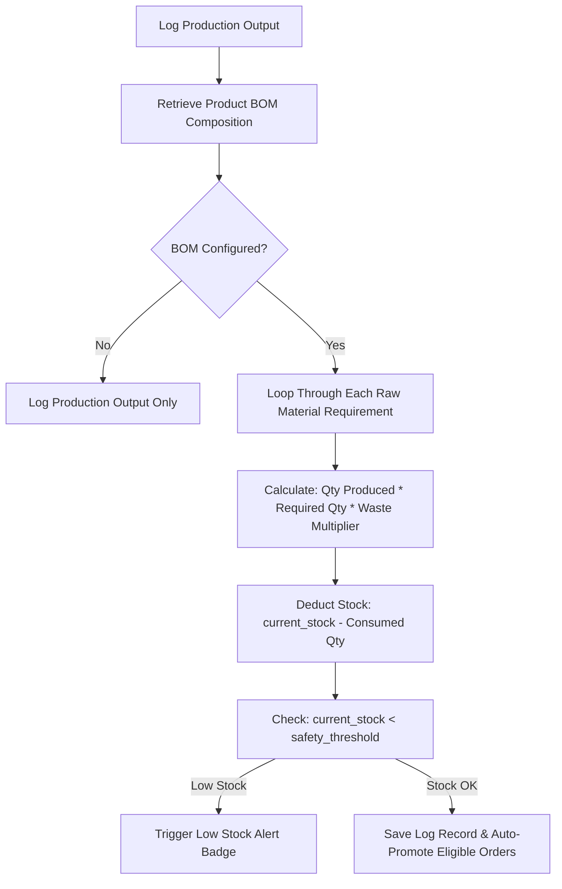
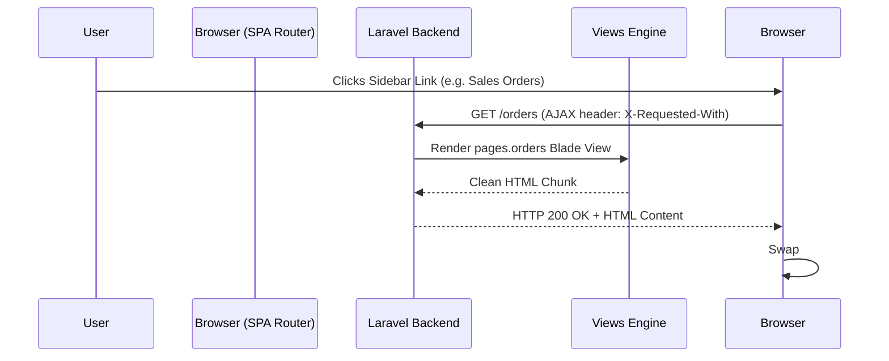

# Praful Welding Works ERP - System Architecture & Design Document

This document details the software architecture, design patterns, computational engines, tax algorithms, and offline execution capabilities powering **Praful Welding Works ERP**.

---

## 🏗️ High-Level Architectural Design

The application follows clean architectural principles combining **Thin Controllers**, **Form Request Validation**, **Domain Service Layers**, and an **AJAX-powered Single Page Application (SPA)** experience.

### Key Service Abstractions (`app/Services/`):
- `BillingService.php`: Custom invoice calculations, GST item tax breakdown, sequential document numbering, payment processing.
- `InvoicePdfService.php`: PDF rendering configuration, tax breakdowns, styling wrappers, and layout compilers for professional invoice printouts.
- `ProductionService.php`: Batch production output logging, BOM raw material inventory auto-deduction, labor cost calculation.
- `PayrollService.php`: Attendance record processing, daily rate & piece-rate wage matrix computations, monthly salary disbursals, salary advance deductions.
- `FinancialService.php`: Financial P&L calculations, monthly turnover, net profit margins, GST liability, and eligible input tax credit (ITC) reconciliation.
- `BackupService.php`: Database SQL dumps, database restores, local snapshot management, safety file rotations.
- `RolePermissionService.php`: Role-based access control (RBAC), permission matrix resolution.
- `ActiveOrderAlertService.php`: Real-time tracking of active orders, in-production batches, and ready-for-dispatch items for top header widgets.
- `InventoryAlertService.php`: Stock safety threshold monitoring and low-stock alert notifications for raw materials and finished goods.
- `AuditLogService.php`: System-wide audit trail logs tracking actions like invoice deletions, settings modifications, security events, etc.
- `EwayBillService.php`: JSON generation and export of standard Indian GSTR-compliant eway bill payloads for transportation dispatch.
- `CategoryService.php`: Manages categories for purchases and expenses including system-protected constraints.

---

## ⚙️ Core Computational Engines

### 1. Bill of Materials (BOM) Auto-Deduction Engine
When factory output is logged on the **Production Logs** page, the system calculates and auto-deducts raw materials from inventory stock via `ProductionService.php`.

#### Mathematical Formulation:
$$\text{Raw Material Consumed} = \text{Quantity Produced} \times \text{BOM Required Qty} \times \left(1 + \frac{\text{Waste } \%}{100}\right)$$

---

### 2. Indian Regional GST Tax Calculation Engine
The system dynamically computes **Intra-State GST** vs **Inter-State IGST** tax brackets based on the client/plant GSTIN state code prefix.

- **Intra-State Transaction (Gujarat -> Gujarat, Code `24`)**:
  $$\text{CGST Amount} = \text{Subtotal} \times \frac{\text{GST Rate}}{2} \times \frac{1}{100}$$
  $$\text{SGST Amount} = \text{Subtotal} \times \frac{\text{GST Rate}}{2} \times \frac{1}{100}$$
  $$\text{IGST Amount} = 0.00$$

- **Inter-State Transaction (Gujarat -> Out of State, e.g. Code `27` Maharashtra)**:
  $$\text{CGST Amount} = 0.00$$
  $$\text{SGST Amount} = 0.00$$
  $$\text{IGST Amount} = \text{Subtotal} \times \text{GST Rate} \times \frac{1}{100}$$

#### GST Input Tax Credit (ITC) Reconciliation:
In `ReportService.php`:
$$\text{Output GST Liability} = \sum \text{CGST Collected} + \sum \text{SGST Collected} + \sum \text{IGST Collected}$$
$$\text{Eligible Input Tax Credit (ITC)} = \sum \text{GST Paid on Procurement & Expenses}$$
$$\text{Net Tax Payable to Govt} = \max(0, \text{Output GST Liability} - \text{Eligible ITC Credit})$$

---

### 3. Financial Profit Engine
`FinancialService.php` aggregates overall factory financial health:

$$\text{Gross Sales Revenue} = \sum \text{Paid Invoice Amounts}$$
$$\text{Cost of Goods Sold (COGS)} = \sum \text{Raw Material Procurement} + \sum \text{Worker Labor Payouts}$$
$$\text{Operating Expenses} = \sum \text{Expenses Ledger Costs}$$
$$\text{Net Profit Margin} = \text{Gross Sales Revenue} - (\text{COGS} + \text{Operating Expenses})$$

---

### 4. 100% Offline Capability & RBAC Security Architecture
The system is built to operate **100% offline without internet** on local client devices:

1. **Local Vendor Assets (`public/vendor/` & `public/fonts/`)**:
   - `jQuery v3.7.1`, `DataTables v1.13.11`, `SweetAlert2 v11.17.2`, `TomSelect v2.4.1`, and `Chart.js v4.4.7` are vendor-bundled locally in `public/vendor/`.
   - Outfit typography files are loaded locally from `public/fonts/outfit/`.
2. **Local Compiled CSS/JS (`public/build/`)**:
   - Tailwind CSS stylesheet and JS engine run completely offline without CDN requests.
   - Custom DataTables CSS rules enforce Royal Blue Pill Pagination (`‹`, `1`, `2`, `›`) and styled searchbars.
3. **Account Deactivation & Super Admin Security**:
   - Public registration is completely disabled. User creation is strictly controlled via `SettingsController`.
   - Super Admin (`pww@gmail.com`) account status is enforced at the Model & Service layer to prevent accidental deactivation (`is_super_admin = 1`).
   - Any deactivated user is caught by middleware and safely routed to the unified glassmorphic `/account-deactivated` screen.
4. **1-Click Simplified Billing Mode Architecture**:
   - Master toggle key `simplified_billing_mode` in `settings` table.
   - When enabled, `SettingsController` forces `track_stock` to `false` and automatically hides manufacturing/production/BOM/inventory/payroll modules from sidebar navigation.
   - Front-end AJAX controller (`window.toggleSimplifiedBillingModeAjax`) performs instant DOM updates without full page reloads.

5. **Automated Background Backup & Off-Site Catch-Up Engine**:
   - `AutoBackupCheckMiddleware` checks execution schedules on authenticated user requests.
   - `BackupService::ensureAutomaticBackupExists()` calculates target scheduled timestamps (HH:MM precision).
   - If a new backup is created, it writes SQL dumps to `storage/app/backups/`, triggers an email attachment via `Mail::raw()` if `auto_email_backup` is enabled, and flashes `auto_download_backup_url`.
   - The front-end JavaScript engine in `app.blade.php` automatically initiates a browser download into the local PC `Downloads` folder.

6. **Hotkeys & Visual Dark Theme Engine**:
   - `app-core.js` intercepts global keyboard events (`Alt+I`, `Alt+P`, `Alt+E`, `Alt+R`, `Alt+S`, `Alt+H`) for rapid SPA navigation.
   - Inline theme script in `app.blade.php` reads `localStorage.getItem('theme')` before DOM paint to prevent light flashes, applying `.dark` classes for high-contrast dark slate styling (`#0f172a` & `#1e293b`).

---

## 🎨 SPA Navigation Architecture

The application uses an AJAX-powered SPA experience driven by jQuery and `app-core.js`:

