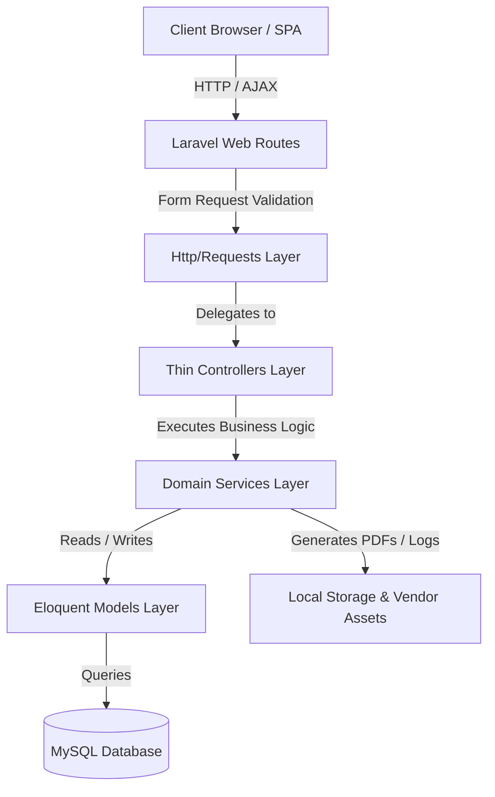
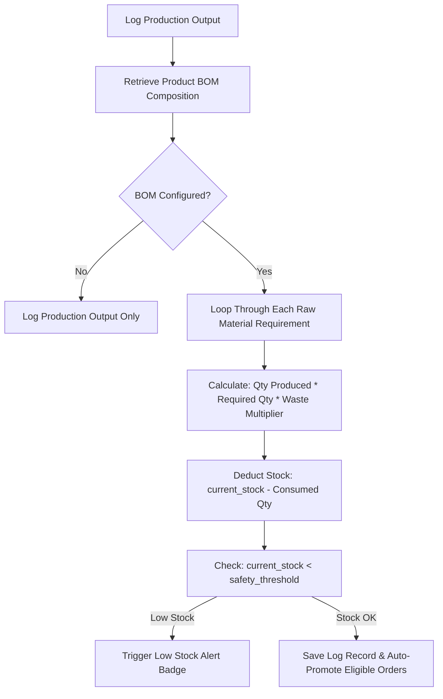
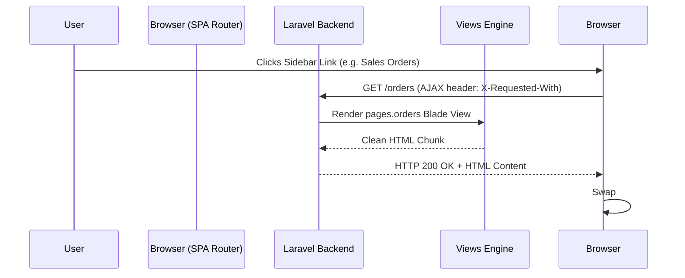

# Praful Welding Works ERP - System Architecture & Design Document

This document details the software architecture, design patterns, computational engines, tax algorithms, and offline execution capabilities powering **Praful Welding Works ERP**.

---

## 🏗️ High-Level Architectural Design

The application follows clean architectural principles combining **Thin Controllers**, **Form Request Validation**, **Domain Service Layers**, and an **AJAX-powered Single Page Application (SPA)** experience.

### Key Service Abstractions (`app/Services/`):
- `InvoiceService.php`: Custom invoice calculations, GST item tax breakdown, sequential document numbering, payment processing.
- `ProductionService.php`: Batch production output logging, BOM raw material inventory auto-deduction, labor cost calculation.
- `PayrollService.php`: Attendance record processing, daily rate & piece-rate wage matrix computations, monthly salary disbursals.
- `ReportService.php`: Financial P&L calculations, GST GSTR-1 & GSTR-3B tax aggregations, CSV/PDF compilations with caching (`Cache::remember`).
- `BackupService.php`: Database SQL dumps, database restores, local snapshot management, safety file rotations.
- `RolePermissionService.php`: Role-based access control (RBAC), permission matrix resolution.

---

## ⚙️ Core Computational Engines

### 1. Bill of Materials (BOM) Auto-Deduction Engine
When factory output is logged on the **Production Logs** page, the system calculates and auto-deducts raw materials from inventory stock via `ProductionService.php`.

#### Mathematical Formulation:
$$\text{Raw Material Consumed} = \text{Quantity Produced} \times \text{BOM Required Qty} \times \left(1 + \frac{\text{Waste } \%}{100}\right)$$

---

### 2. Indian Regional GST Tax Calculation Engine
The system dynamically computes **Intra-State GST** vs **Inter-State IGST** tax brackets based on the client/plant GSTIN state code prefix.

- **Intra-State Transaction (Gujarat -> Gujarat, Code `24`)**:
  $$\text{CGST Amount} = \text{Subtotal} \times \frac{\text{GST Rate}}{2} \times \frac{1}{100}$$
  $$\text{SGST Amount} = \text{Subtotal} \times \frac{\text{GST Rate}}{2} \times \frac{1}{100}$$
  $$\text{IGST Amount} = 0.00$$

- **Inter-State Transaction (Gujarat -> Out of State, e.g. Code `27` Maharashtra)**:
  $$\text{CGST Amount} = 0.00$$
  $$\text{SGST Amount} = 0.00$$
  $$\text{IGST Amount} = \text{Subtotal} \times \text{GST Rate} \times \frac{1}{100}$$

#### GST Input Tax Credit (ITC) Reconciliation:
In `ReportService.php`:
$$\text{Output GST Liability} = \sum \text{CGST Collected} + \sum \text{SGST Collected} + \sum \text{IGST Collected}$$
$$\text{Eligible Input Tax Credit (ITC)} = \sum \text{GST Paid on Procurement & Expenses}$$
$$\text{Net Tax Payable to Govt} = \max(0, \text{Output GST Liability} - \text{Eligible ITC Credit})$$

---

### 3. Financial Profit Engine
`FinancialService.php` aggregates overall factory financial health:

$$\text{Gross Sales Revenue} = \sum \text{Paid Invoice Amounts}$$
$$\text{Cost of Goods Sold (COGS)} = \sum \text{Raw Material Procurement} + \sum \text{Worker Labor Payouts}$$
$$\text{Operating Expenses} = \sum \text{Expenses Ledger Costs}$$
$$\text{Net Profit Margin} = \text{Gross Sales Revenue} - (\text{COGS} + \text{Operating Expenses})$$

---

### 4. 100% Offline Capability Architecture
The system is built to operate **100% offline without internet** on local client devices:

1. **Local Vendor Assets (`public/vendor/`)**:
   - `jQuery`, `SweetAlert2`, `DataTables`, `TomSelect`, and `Chart.js` are vendor-bundled locally in `public/vendor/`.
2. **Local Compiled CSS/JS (`public/build/`)**:
   - Tailwind CSS stylesheet is compiled into a standalone 77 KB local CSS bundle (`public/build/assets/app-*.css`).
3. **Local Database & Backups**:
   - Runs on local MySQL (`127.0.0.1:3306`). Automated backups save directly to local disk (`storage/app/backups/`).

---

## 🎨 SPA Navigation Architecture

The application uses an AJAX-powered SPA experience driven by jQuery and `app-core.js`:

