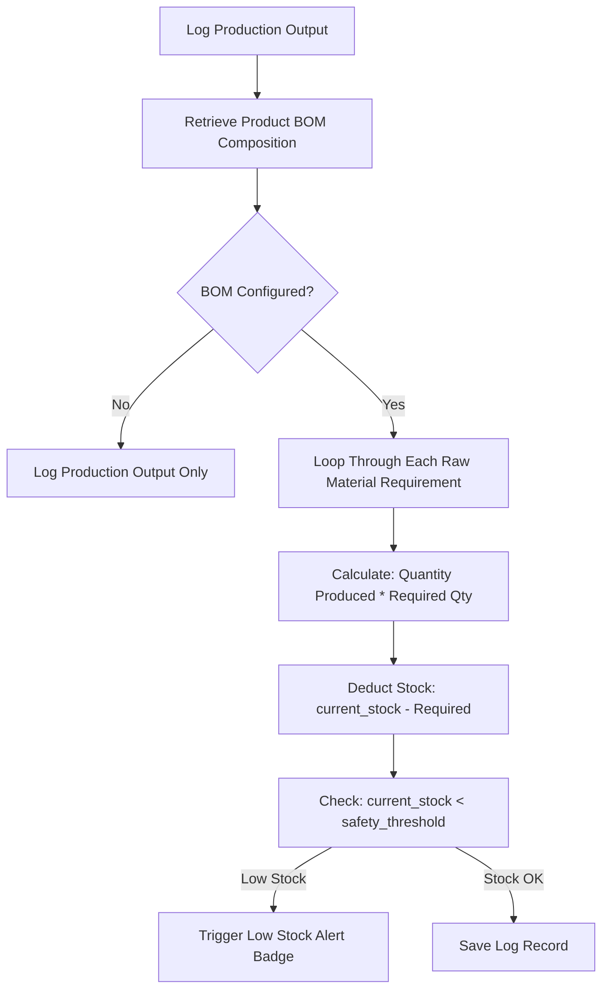
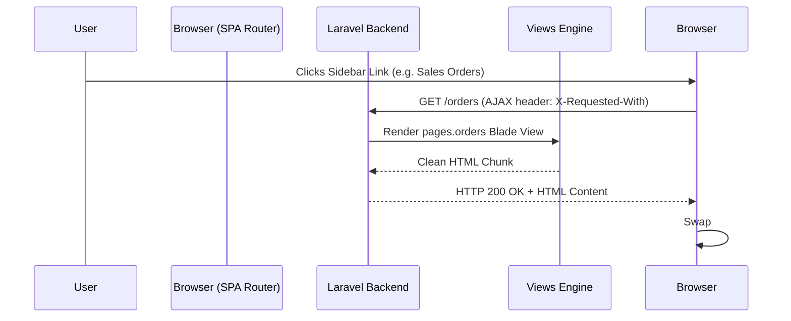

# Praful Welding Works ERP - System Architecture & Business Logic

This document details the internal architecture, computational engines, business rules, tax algorithms, and frontend/backend integrations in **Praful Welding Works ERP**.

---

## ⚙️ Core Business Engines

### 1. Bill of Materials (BOM) Auto-Deduction Engine
When factory output is logged on the **Production Logs** page, the system calculates and auto-deducts the required raw materials from live inventory stock using `ProductionService.php`.

#### Mathematical Formulation:
$$\text{Raw Material Deducted} = \text{Quantity Produced} \times \text{BOM Quantity Required Per Piece}$$

---

### 2. Indian Regional GST Tax Calculation Engine
The system dynamically computes **Intra-State GST** vs **Inter-State IGST** tax brackets based on the client/plant GSTIN state code prefix.

- **Intra-State Transaction (Gujarat -> Gujarat, Code `24`)**:
  $$\text{CGST Amount} = \text{Subtotal} \times \frac{\text{GST Rate}}{2} \times \frac{1}{100}$$
  $$\text{SGST Amount} = \text{Subtotal} \times \frac{\text{GST Rate}}{2} \times \frac{1}{100}$$
  $$\text{IGST Amount} = 0.00$$

- **Inter-State Transaction (Gujarat -> Out of State, e.g. Code `27` Maharashtra)**:
  $$\text{CGST Amount} = 0.00$$
  $$\text{SGST Amount} = 0.00$$
  $$\text{IGST Amount} = \text{Subtotal} \times \text{GST Rate} \times \frac{1}{100}$$

#### GST Tax Credit (ITC) Reconciliation:
In the **Reports** audit module:
$$\text{Output GST Liability} = \sum \text{CGST Collected} + \sum \text{SGST Collected} + \sum \text{IGST Collected}$$
$$\text{Eligible Input Tax Credit (ITC)} = \sum \text{GST Paid on Procurement & Expenses}$$
$$\text{Net Tax Payable to Govt} = \max(0, \text{Output GST Liability} - \text{Eligible ITC Credit})$$

---

### 3. Financial Profit Engine
`FinancialService.php` aggregates factory financial performance:

$$\text{Gross Sales Revenue} = \sum \text{Paid Invoice Amounts}$$
$$\text{Cost of Goods Sold (COGS)} = \sum \text{Raw Material Purchases} + \sum \text{Worker Labor Payouts}$$
$$\text{Operating Expenses} = \sum \text{Expenses Ledger Costs}$$
$$\text{Net Profit Margin} = \text{Gross Sales Revenue} - (\text{COGS} + \text{Operating Expenses})$$

---

### 4. Project-Wide Duplicate Record Prevention
To maintain data integrity and prevent double-billing or double-logging:

1. **Frontend Disabling**:
   Upon form submission, `app-core.js` instantly disables the primary action button (`disabled`, `opacity-50`, `pointer-events-none`) and renders a loading spinner.
2. **Backend 422 Validation**:
   Controllers (`ExpenseController`, `PurchaseController`, `ProductionController`, `ClientController`, `EmployeeController`, `ProductController`) execute strict duplicate checking before database insertion. If exact matching parameters are detected, HTTP Status `422 Unprocessable Content` is returned.
3. **URL Parameter Sanitization**:
   Forms opened via URL parameters (e.g. `?open=1`) immediately execute `window.history.replaceState` to strip query strings, preventing re-triggering upon page reloads.

---

## 🎨 SPA Navigation Architecture

The application uses an AJAX-powered SPA experience driven by jQuery and `app-core.js`:

